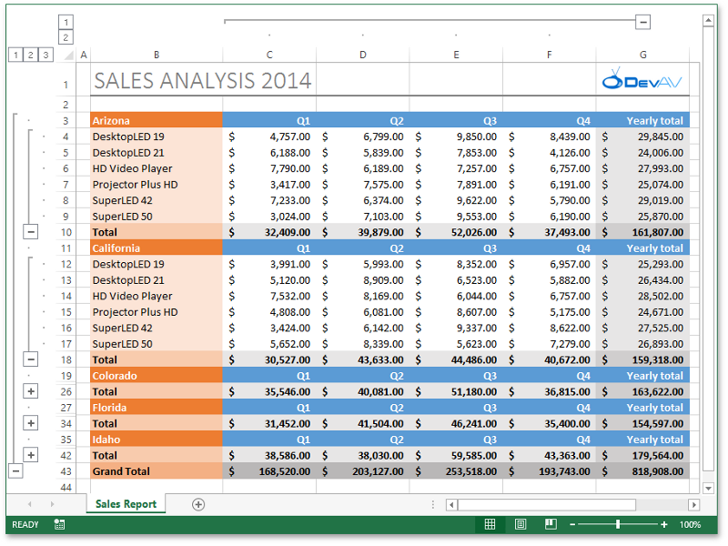

<!-- default badges list -->

<!-- default badges end -->

# Excel Export API -  Generate a Sales Report

This example demonstrates how to use the [Excel Export API](https://docs.devexpress.com/OfficeFileAPI/114031/excel-export-library) to generate the "Sales Report" document shown in the image below.

## Implementation Details

This example introduces API properties and methods used to perform the following operations:

* Create a new workbook
* Create and rename a worksheet
* Create columns and rows, and adjust the column width and row height
* Create cells and set their values
* Format cells (set the cell font, background color, alignment, borders, number format, etc.)
* Specify print options (define the print area, add headers and footers to a worksheet printout, adjust page settings)
* Create groups of rows and columns and specify outline settings
* Use formulas to calculate subtotals
* Insert a picture into a cell

## Files to Review

* [Form1.cs](./CS/XLExportExampleSalesReport/Form1.cs) (VB: [Form1.vb](./VB/XLExportExampleSalesReport/Form1.vb))
* [SalesData.cs](./CS/XLExportExampleSalesReport/SalesData.cs) (VB: [SalesData.vb](./VB/XLExportExampleSalesReport/SalesData.vb))

## Documentation

* [Get Started with the Excel Export Library - Generate an Excel File](https://docs.devexpress.com/OfficeFileAPI/114032/excel-export-library/getting-started)
<!-- feedback -->
## Does this example address your development requirements/objectives?

 

(you will be redirected to DevExpress.com to submit your response)
<!-- feedback end -->
